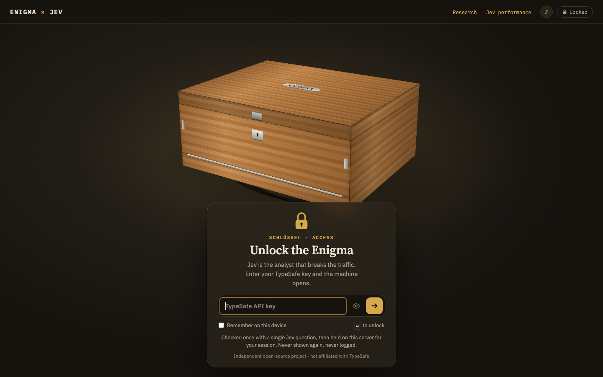
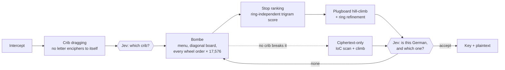
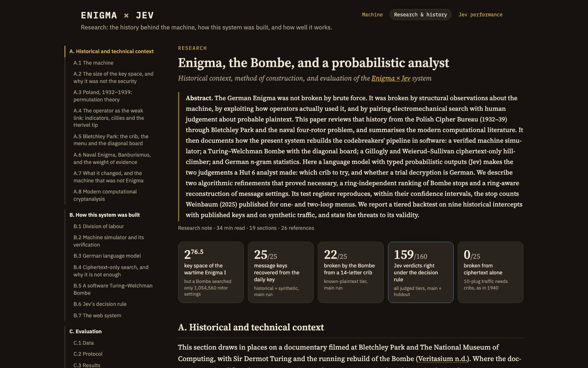
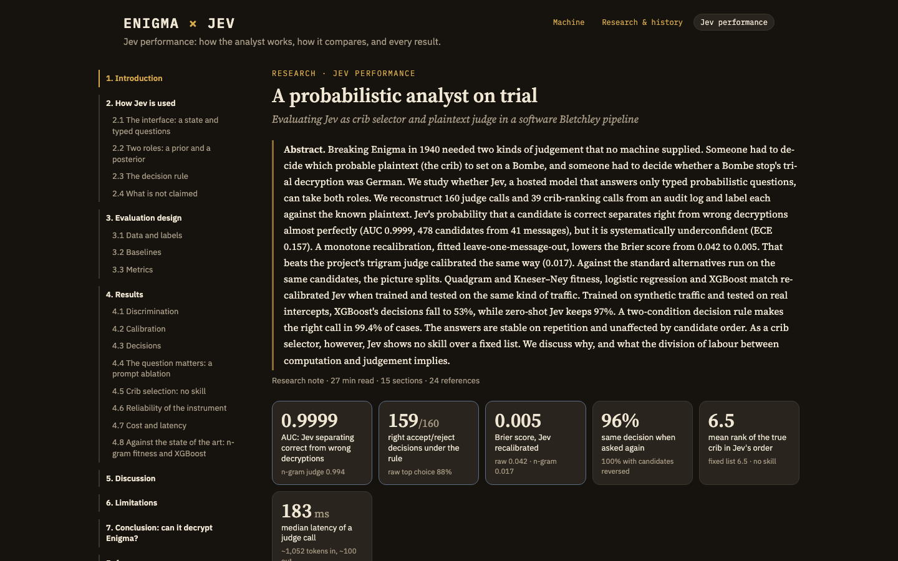

# enigma-jev

**A software Turing–Welchman Bombe that breaks real Enigma traffic, with a probabilistic analyst deciding what counts as German.**

[](https://github.com/agodoy21/enigma-jev/actions/workflows/ci.yml)
[](LICENSE)
[](https://bun.sh)
[](tsconfig.json)
[](test/)



enigma-jev rebuilds Bletchley Park's pipeline in software, then measures it. The pipeline is a verified Enigma I, M3 and M4, crib dragging, a Bombe with Welchman's diagonal board, and a ciphertext-only hill-climber. Two steps in that pipeline were human judgement calls: which probable phrase to try, and whether a trial decryption is German. Here **Jev**, a model that answers only typed probabilistic questions, makes those two calls. The code runs a tiered backtest against historical intercepts with published keys. A second study compares Jev against n-gram judges and XGBoost on the same candidates.

It comes with three pages:

| | |
|---|---|
| **The machine** (`/`) | A 3D Enigma I you can key, type on and transmit from. Bletchley then breaks your message live: crib dragging, Jev's crib ranking, the Bombe across a worker pool, and Jev's verdict. |
| **Research & history** (`/research`) | A long-form paper covering Rejewski to the M4 Project, how the system is built, and its evaluation. Five figures are computed live in the browser, including a running Bombe. |
| **Jev performance** (`/jev`) | A second paper evaluating Jev as crib selector and plaintext judge. It covers discrimination, calibration, decisions, reliability, cost, and a head-to-head against XGBoost. |

## Try it in 60 seconds

You need [Bun](https://bun.sh) 1.3 or later, and a TypeSafe API key for the Jev steps.

```bash
bun install
```

```bash
bun run web
```

Open <http://localhost:5199>. The machine stays closed until you enter a TypeSafe key. The server checks it with one Jev question, then seals it into an encrypted, HttpOnly session cookie that the page's scripts can't read and only the server can open. The key is never written to disk and never logged. The Research and Jev pages need no key.

On the command line, put the key in `.env` (see [`.env.example`](.env.example)):

```bash
bun run cli doctor
```

```bash
bun run cli break "GCDSE AHUGW TQGRK VLFGX UCALX VYMIG MMNMF DXTGN VHVRM MEVOU YFZSL RHDRR XFJWC FHUHM UNZEF RDISI KBGPM YVXUZ" --machine I --date 1930 --crib FEINDLIQEINFANTERIE
```

That is the test message from the 1930 Enigma I manual. The Bombe runs your crib first and recovers the key (UKW A, II-I-III, plugs AM FI NV PS TU WZ). Add `--no-jev` to judge with n-gram statistics only; drop `--crib` to let Jev rank the built-in crib list.

```bash
bun run cli encrypt "ANGRIFF IM MORGENGRAUEN" --rotors II,IV,V --rings BUL --start BLA --plugs "AV BS"
```

## Deploy to Vercel

The repository deploys to Vercel as it is:

- **Pages:** the three pages are built into static files (`bun run build` → `dist/`).
- **API:** every `/api/*` route runs in one Bun function (`api/index.ts`), with up to 300 seconds for a break.

`vercel.json` holds the configuration. The project needs two settings:

1. **Root Directory:** the repository root (leave it empty). **Framework Preset:** Other. `vercel.json` sets the build.
2. **Environment variable `SESSION_SECRET`:** any long random string, for example from `openssl rand -base64 32`. It encrypts the session cookie, so every function instance can read it. Without it, unlocking is refused.

A break on Vercel runs on the function's CPU, and its duration is capped at 300 seconds on the Hobby plan. That is ample for a break from your own crib; a long search through the crib list can hit the cap. For those, run the server locally.

## Results at a glance

These results are from the main run (seed 1941): 9 historical messages with published keys and 16 synthetic messages under seeded random keys. A tier **breaks** a message when its best candidate matches at least 90% of the published plaintext.

| Tier | What is known | Broken |
|---|---|---|
| `verify` | the full key; the machine must reproduce the published plaintext | **25/25** |
| `key` | the daily key; the message key is searched | **25/25** |
| `crib` | the message's true first 14 letters | **22/25** |
| `bombe` | machine and service; cribs are chosen from a fixed list | 0/25 |
| `climb` | the machine only (ciphertext only) | 0/25 |

Ten-plug traffic falls to a Bombe with the right crib and not to ciphertext-only statistics. That was also the position in 1940.

**Jev as judge** (478 candidates from 160 judge calls, labelled against the known plaintext):

- It separates right from wrong decryptions with AUC **0.9999**.
- Its raw probabilities are underconfident (ECE 0.157). A leave-one-message-out recalibration takes the Brier score from 0.042 to **0.005**.
- Its two-condition decision rule makes the right accept or reject call in **159 of 160** cases (99.4%, 95% CI 98.1–100%).
- **As crib selector it shows no skill over a fixed list.** The mean rank of the true crib is 6.5 in both orders.

**Against the standard judges** (leave-one-text-out cross-validation, cluster bootstrap):

| Judge | AUC | Right decisions | Trained on the evaluation traffic? |
|---|---|---|---|
| Index of coincidence | 0.988 | 88.8% | yes |
| Trigram German-ness | 0.993 | 93.8% | yes |
| Quadgram fitness | 0.9995 | 98.8% | yes |
| Kneser–Ney 5-gram | 0.9985 | 98.8% | yes |
| Logistic regression, 12 features | 0.9996 | 97.5% | yes |
| XGBoost, 12 features | 0.993 | 98.8% | yes |
| **Jev, zero-shot** | **0.9999** | **98.8%** | no |

On the same kind of traffic, trained judges tie with Jev. Under distribution shift they do not. Trained on synthetic traffic and tested on the real intercepts, XGBoost decides **53%** of calls correctly, while zero-shot Jev decides **97%**.

**The Bombe against Weinbaum (2025).** The test register reproduces the stop counts published for one- and two-loop menus, within their confidence intervals. It also reproduces the share of settings that can produce a Zygalski female: 0.4059 measured over all 60 wheel orders, against 0.4052 in Weinbaum's model.

The full tables, intervals and caveats are in the two papers. Every number there is read from `reports/` at page load.

## How it works



1. **Crib dragging.** Each probable phrase is slid along the intercept. Any position where a letter would encipher to itself is ruled out, because Enigma never does that.
2. **Crib choice (Jev).** A `choice` question over the surviving cribs, plus "none".
3. **Bombe.** The crib's letter pairs form a menu. For every wheel order and rotor position, the Bombe hypothesises a plug partner for the busiest letter on a loop and propagates it through the menu and Welchman's diagonal board. A setting that doesn't contradict itself is a *stop*, and it comes with part of the plugboard. A second pass lets the middle rotor step inside the crib, because the rings are unknown.
4. **Stop ranking.** Stops are ranked by a trigram score maximised over every right-ring turnover at once. A suffix sum covers all 26 rings in one pass.
5. **Plugboard climb.** The best stops are finished by a hill-climb, with the menu's pairs locked, followed by a ring refinement.
6. **Verdict (Jev).** A `choice` over up to four distinct candidates plus "none", and a `noul` P(correct) for each. Jev sees only the texts, never the search's scores. On the web page, German letter statistics must also agree before a break is shown.

More detail is in [docs/architecture.md](docs/architecture.md), the [web API and event stream](docs/web.md), and [how Jev is used](docs/jev.md).

## Reproduce the papers

```bash
bun run reproduce
```

This runs offline. It runs the tests, rebuilds the Jev analysis from the local audit log (if there is one), recounts the Bombe stops and reruns the judge comparison. `--backtests` and `--experiments` rerun the steps that make Jev calls; those need a key.

| Result | Command | Output | Shown in |
|---|---|---|---|
| Tier table, main run | `bun run backtest all --seed 1941` | `reports/backtest-*.{md,json}` | Research C.3, Jev §7 |
| Tier table, holdout | `bun run backtest synthetic --seed 2024` | `reports/backtest-*.{md,json}` | Research C.3 |
| Jev discrimination, calibration, decisions | `bun run analyze:jev` | `reports/jev-analysis.json` | Jev §§1–7 |
| Test–retest and position experiments | `bun run src/analysis/jev-experiments.ts` | `reports/jev-experiments.json` | Jev §4.6 |
| Judge comparison, learning curve, shift | `bun run analyze:judges` | `reports/judge-comparison.json` | Jev §4.8 |
| Bombe stops against Weinbaum | `bun run analyze:stops` | `reports/bombe-stops.json` | Research B.5, Table B1 |

The Python step needs a virtual environment:

```bash
python3 -m venv .venv && .venv/bin/pip install -r analysis/requirements.txt
```

See [docs/evaluation.md](docs/evaluation.md) for the protocol, the scoring rules and how each report is built.

<table>
<tr>
<td></td>
<td></td>
</tr>
</table>

## Project layout

```
src/
  enigma/      the machine: rotors I–VIII, Beta/Gamma, reflectors, rings, plugboard, double step
  break/       Bombe, test register, ciphertext-only climb, the shared search engine
  lang/        German, English and Spanish n-gram models; operator-style text normalisation
  jev/         the Jev client, crib ranking, the judge, response schemas
  pipeline/    tier runners and the acceptance rules shared by the CLI and the web page
  backtest/    historical and synthetic cases, the runner, report writer
  analysis/    Jev evaluation, reliability experiments, Bombe stop counts
  web/         server, session gate, streamed break (SSE), worker pool
  cli.ts       break | backtest | encrypt | decrypt | doctor
api/           the Vercel function: every /api/* route (shares src/web/api.ts)
web/
  pages/       index, research, jev
  app/         the machine page: steps, gate, Bletchley panel
  machine/     the CSS 3D Enigma
  research/    live figures and the Bombe demo
  jev/         charts and tables for the Jev paper
  shared/      DOM helpers, glossary, citation previews, operator habits
analysis/      Python: n-gram and XGBoost judges, metrics, bootstrap
data/          historical intercepts, synthetic plaintexts, language corpora
reports/       every number the papers show
scripts/       reproduce.ts
test/          52 tests
```

## Jev and TypeSafe

Jev is a hosted model served by TypeSafe's System One API. It answers typed questions about a text: `noul` (a probability), `choice` (a distribution over named options) and `score`. **It never returns prose, so it cannot write out a decryption.** All the cryptanalysis runs locally. Jev only makes the two calls an analyst made.

- **What is sent:** the intercept, its service and date, the candidate decryptions and the question.
- **What is never sent:** the search's scores, the published key, the plaintext.
- **The audit log:** every request and answer, but never the key, is appended to `~/.enigma-jev/jev-calls.jsonl`. The Jev paper is rebuilt from that file.
- **Where the key is read from:** `TYPESAFE_API_KEY`, then `./.env`, then `~/.enigma-jev/.env`. `JEV_MODEL` overrides the pinned default `jev-1.13.0`, the model behind every published number.

> **Independence.** enigma-jev is an independent open-source project. It is not affiliated with, endorsed by or sponsored by TypeSafe. "TypeSafe", "Jev" and "System One" are used only to name the service this code calls. You need your own key, and your use of the API is governed by TypeSafe's terms.

## Limitations

- **Ten plugs defeat the ciphertext-only climb.** With 6 plugs, a long message falls in seconds. With 10 plugs, standard from 1939, the right rotor setting shows almost no index-of-coincidence signal.
- **A Bombe needs a menu.** Short or loopless cribs give thousands of stops, which Bletchley would not have run either. The fixed crib list rarely contains the real opener: 0/25 on the `bombe` tier.
- **Small evaluation.** There are 9 scored historical intercepts, plus synthetic traffic written for this project. Every interval is wide, and the papers' threats-to-validity sections set out what that allows.
- **M4 is only partly searched.** The Bombe tiers are given the wheel order and the greek wheel, and search only the rest.
- **Jev is a hosted service.** Its answers can change between model revisions, so the results are pinned to `jev-1.13.0` and the raw calls are logged.

## Contributing

Contributions are welcome, and historical intercepts with sound provenance most of all. [CONTRIBUTING.md](CONTRIBUTING.md) covers setup and the checks every change must pass:

```bash
bun run check
```

[data/README.md](data/README.md) explains how to add a message. Report security issues as described in [SECURITY.md](SECURITY.md).

## Citation

If you use this code or its results, please cite it as described in [CITATION.cff](CITATION.cff).

## Acknowledgements

The historical messages and their keys come from the work of Frode Weierud and Geoff Sullivan (cryptocellar), Stefan Krah and the M4 Message Breaking Project (bytereef), Enigma-Hörenberg, the Crypto Museum, the Franklin Heath Enigma wiki, the ringstellung Enigma collection and German Wikipedia. Each message's own sources are listed in [data/historical/messages.json](data/historical/messages.json). The Bombe validation follows Jonah Weinbaum, *Action This Day* (Dartmouth College MS thesis, 2025).

## License

[MIT](LICENSE) © 2026 Andres Godoy
