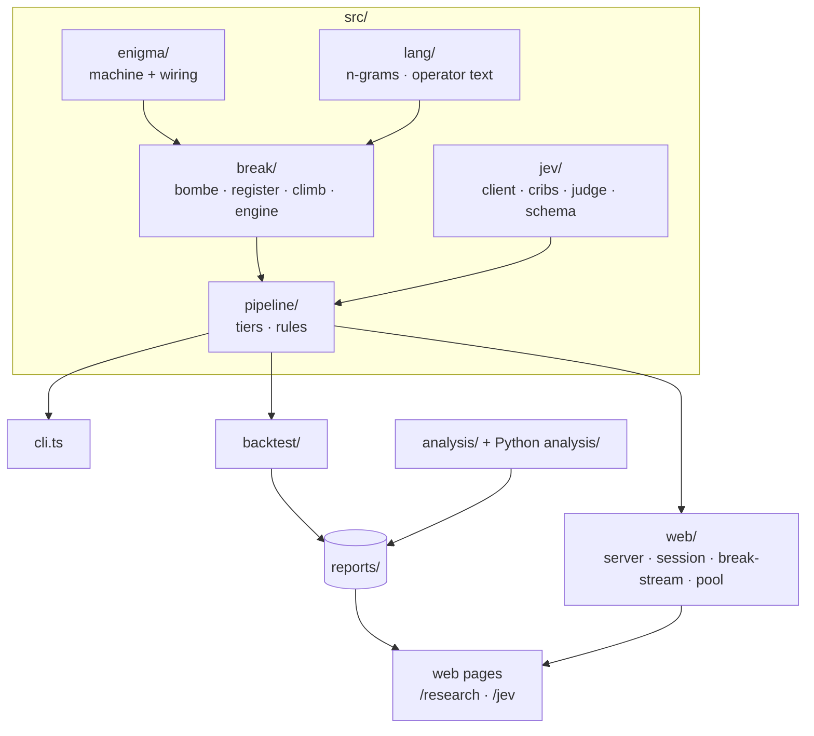

# Architecture

enigma-jev has four layers:

- a verified cipher machine;
- the searches that attack it;
- the rules that decide what counts as a break;
- three front ends (the CLI, the backtest and the web page) that share those rules.

Jev is called at exactly two points: crib choice and the verdict. Everything else runs locally.

## The machine: `src/enigma/`

`machine.ts` implements Enigma I, M3 and M4:

- rotors I–VIII, plus the Beta and Gamma thin rotors;
- reflectors A, B, C, B-thin and C-thin;
- ring settings and the plugboard;
- the double step of the middle rotor.

`wiring.ts` holds the historical wirings.

`encrypt(key, text, trace?)` can record every key press, with the rotor positions and the signal path. The web page uses that record to animate the lamps.

The browser imports the same module, so the lamps light exactly what the real machine would. `test/machine.test.ts` checks the machine against the textbook vector and against every historical message with a published key.

## The searches: `src/break/`

| Module | What it does |
|---|---|
| `bombe.ts` | Turing–Welchman Bombe. Builds a menu from a crib at a position. For each wheel order and rotor setting it tests a plug hypothesis for the busiest letter on a loop, with Welchman's diagonal board. Turnovers `none` or `all` decide whether the middle rotor may step inside the crib. Stops are ranked by a trigram score maximised over all 26 right-ring turnovers at once, using a suffix sum. The best stops get a plugboard hill-climb (menu pairs locked) and a ring refinement. |
| `register.ts` | The Bombe's test register as a standalone model: menus, loops, propagation with and without the diagonal board, and live counts. The research page's running Bombe and `src/analysis/bombe-stops.ts` both use it, and `test/register.test.ts` pins it down. |
| `climb.ts` | Ciphertext only, after Gillogly (1995) and Weierud & Sullivan (2005). It scans every wheel order and start position on index of coincidence, then finds ring turnovers, then climbs the plugboard on IoC and then trigrams. |
| `engine.ts` | The shared `Candidate` type, scoring, and the hill-climb primitives. |

## Language: `src/lang/`

`ngrams.ts` trains interpolated trigram, bigram and unigram models on `data/corpus*/`: German, English and Spanish. The German model is trained in four operator styles:

- words run together;
- `X` between words;
- `Q` for `CH`;
- `J` between words (naval).

`normalize.ts` turns free text into operator text: umlauts spelled out, numbers written as words, and so on.

## Jev: `src/jev/`

- **`client.ts`:** the HTTP client for TypeSafe's System One endpoint. It handles retries, timeouts and the audit log, and resolves the key from `TYPESAFE_API_KEY`, then `./.env`, then `~/.enigma-jev/.env`.
- **`schema.ts`:** zod schemas for the typed question and answer formats (`noul`, `choice`, `score`).
- **`cribs.ts`:** the crib list and `rankCribs`.
- **`judge.ts`:** `judge` and its decision rule.

[jev.md](jev.md) has the full picture.

## Rules and tiers: `src/pipeline/`

`tiers.ts` runs the backtest tiers (`verify`, `key`, `crib`, `bombe`, `climb`) and decides which wheel orders and reflectors a date allows. `rules.ts` holds the acceptance rules shared by the CLI and the web page:

| Constant | Value | Meaning |
|---|---|---|
| `MIN_FREE` | 12 | letters beyond the assumed crib needed before any verdict |
| `STRICT` | 0.55 | German-ness needed when no Jev verdict is available |
| `GERMAN_FLOOR` | 0.42 | German-ness a Jev acceptance must also reach. None of the 76 correct decryptions in the evaluation set fall below it. |

`planCribs` orders the Bombe's work: the user's own crib first, then the cribs that survive dragging, in Jev's order.

## Front ends

- **`src/cli.ts`:** `break`, `backtest`, `encrypt`, `decrypt` and `doctor`.
- **`src/backtest/`:**
  - `cases.ts` loads historical and synthetic cases;
  - `run.ts` scores every tier;
  - `worker.ts` runs cases in parallel;
  - `report.ts` writes `reports/backtest-<time>.{md,json}`.
- **`src/web/`:** the server and its API. [web.md](web.md) covers it.
- **`src/analysis/`:** rebuilds the Jev paper from the audit log (`jev-eval.ts`), runs the reliability experiments (`jev-experiments.ts`) and counts Bombe stops (`bombe-stops.ts`).
- **`analysis/` (Python):** the judge comparison. See [evaluation.md](evaluation.md).

## The pages: `web/`

| Folder | Contents |
|---|---|
| `pages/` | The three HTML entry points. Bun bundles their scripts and styles on the fly. |
| `app/` | The machine page. `main.ts` wires the handlers. `steps/` holds one module per step. `gate.ts` is the key gate. `bletchley.ts` renders the break stream. Modules reach each other through the late-bound `nav` and `handlers` objects in `stage.ts`, which avoids circular imports. |
| `machine/` | The CSS 3D Enigma, built from faces by `machine3d.ts`: the oak case, lid, front flap, thumbwheels, lampboard, keys and plugboard. |
| `research/` | The research paper's live figures (`labs/`) and the running Bombe (`bombe-demo.ts`). |
| `jev/` | The Jev paper's charts and tables. Every value is bound to a report. |
| `shared/` | DOM helpers, the German ⇄ English glossary, citation previews and operator habits. |
| `styles/` | Design tokens, base styles, and the styles for each page. |
